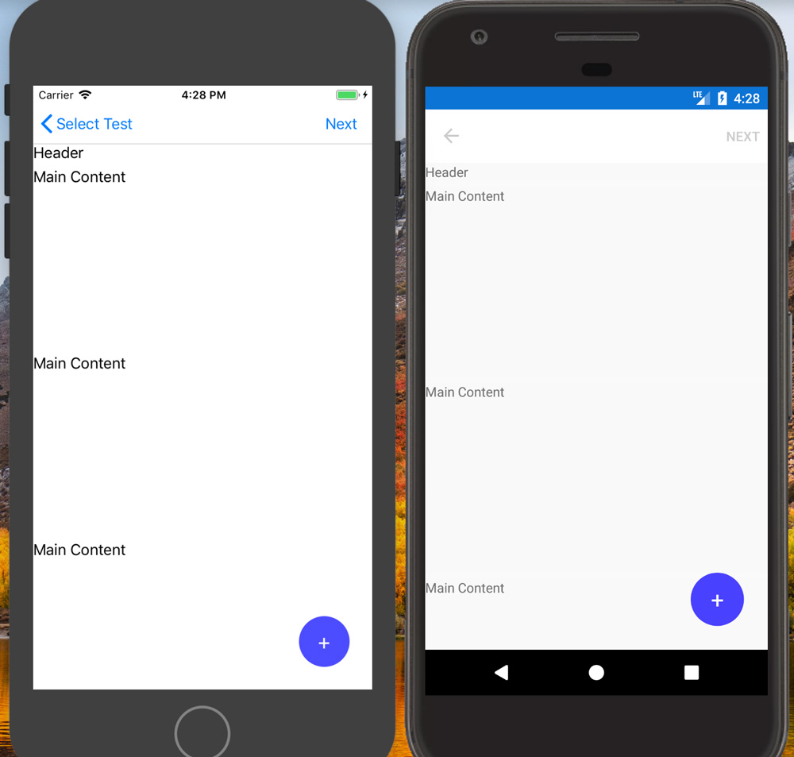

# AiForms.Effects for .NET MAUI

AiForms.Effect は Android と iOS に特化することにより、標準のコントロールをより便利にするための機能を提供する .NET MAUI の Effectsライブラリです。


## 機能

* [Floating](#floating)
    * ページの前面の任意の場所に複数のフローティングな要素(FABなど)を配置する。

> 多くの機能が標準で実装されたのでオーナー自身が必要な機能だけをXamarin版から移植しています。
> 他の機能は必要に応じて移植・追加する可能性があります。

## **トリガープロパティ**

Effectの主要なプロパティを設定するだけでEffectが起動できます。
このプロパティはトリガープロパティとします。
例えば、AddCommandの場合は Command や LongCommand がトリガープロパティになります。このドキュメントに該当のプロパティには trigger と記載しています。


## Nuget インストール

```bash
Install-Package AiForms.Maui.Effects
```


### 利用準備

MauiProgram.csに``UseAiEffects()``を記述します。

```csharp
var builder = MauiApp.CreateBuilder();
builder.UseAiEffects();
```


## Floating

ページの上の任意の場所に複数のフローティングView (Floating Action Buttonなど) を配置するEffectです。
配置されは要素はContentPageより前面に表示され、ContentPageのスクロールの影響を受けません。

### 使い方

このサンプルでは、垂直下端から上に25dp、水平右端から左に25dpの位置に配置しています。

```xml
<ContentPage xmlns:ef="clr-namespace:AiForms.Effects;assembly=AiForms.Maui.Effects">
    
    <ef:Floating.Content>
        <ef:FloatingLayout>
            <!-- 右下から上に25dp 左に25dp -->
            <!-- Code behindのハンドラ指定やViewModelのBindingも可能 -->
            <!-- MAUI版からFloatingViewはなくなりました -->
            <Button
                VerticalLayoutAlignment="End" 
                HorizontalLayoutAlignment="End"
                ef:FloatingLayout.OffsetX="-25"
                ef:FloatingLayout.OffsetY="-25"
                ef:FloatingLayout.IsVisible="{Binding ButtonVisible}"
                Clicked="BlueTap"
                BackgroundColor="{Binding ButtonColor}" 
                BorderRadius="28"
                WidthRequest="56"
                HeightRequest="56"
                Text="+"
                FontSize="24"
                TextColor="White"
                Padding="0" />
        </ef:FloatingLayout>
    </ef:Floating.Content>

    <StackLayout>
        <Label Text="MainContents" />
    </StackLayout>
</ContentPage>
```

 

### Property

* Content (trigger)
    * FloatingViewを配置するためのルート要素で FloatingLayoutクラスです。

### FloatingLayout

ページ上に複数のViewを自由に配置できるレイアウト要素です。  
子要素に添付プロパティで``OffsetX``、``OffsetY``などの追加情報を設定できます。

子要素の配置は``VerticalOptions``と``HorizontalOptions``で決まり、``OffsetX``と``OffsetY``の値で相対的な位置調整を行います。

#### 添付プロパティ

* OffsetX
    * 水平方向の位置の調整値。HorizontalLayoutAlignmentからの相対値を指定します。(Fillの場合は無効)
* OffsetY
    * 垂直方向の位置の調整値。VerticalLayoutAlignmentからの相対値を指定します。(Fillの場合は無効)
* IsVisible
    * Viewを表示するかどうかのbool値。
    * 標準のIsVisibleはFloatingLayout上だと正しく機能しない可能性があります。

### FloatingActionButton

FloatingActionButtonコントロールです。
Effectではありませんが便宜上実装しています。
iOSは独自実装で、AndroidはNativeのFloatingActionButtonを使用しています。

普通のコントロールなのでFloatingLayout以外でも使用可能です。

#### プロパティ

* Command
    * タップしたときのアクション
* ImageSource
    * 中央に配置する画像
* Color
    * ボタン全体の色
* ImageColor
    * 画像の色

## 寄付

開発継続のため、寄付を募集しています。

寄付をいただけるとやる気が非常にアップしますので、どうかよろしくお願いいたします🙇

* [PayPalMe](https://paypal.me/kamusoftJP?locale.x=ja_JP)

## スポンサー

スポンサーも募集しています。
こちらはサブスクリプション制になります。

* [GitHub Sponsors](https://github.com/sponsors/muak)

## License

MIT Licensed.
